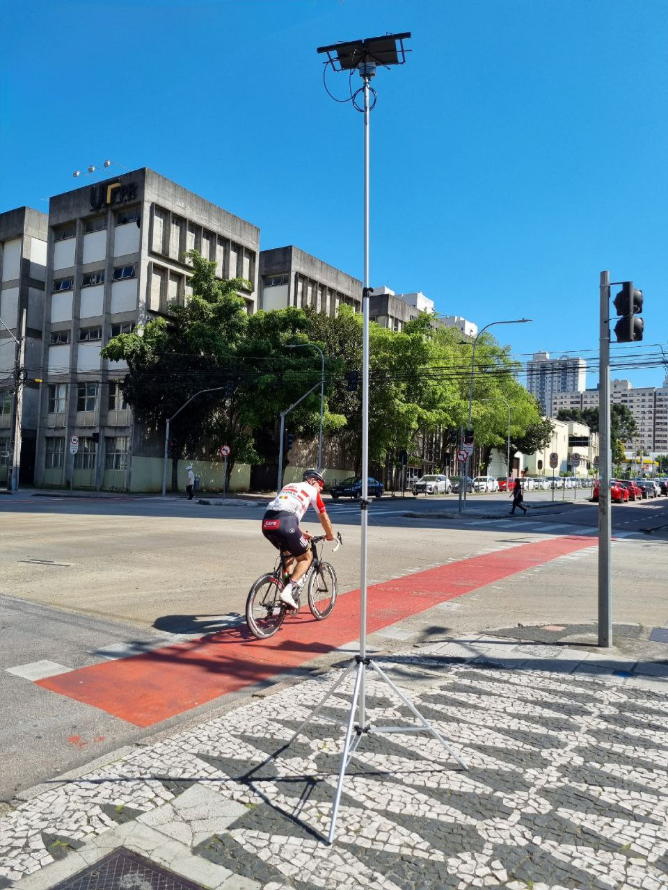
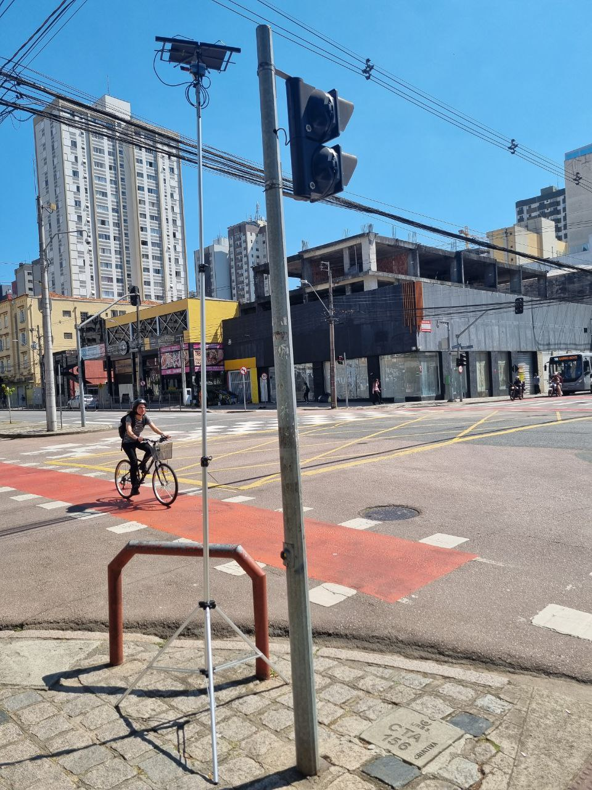
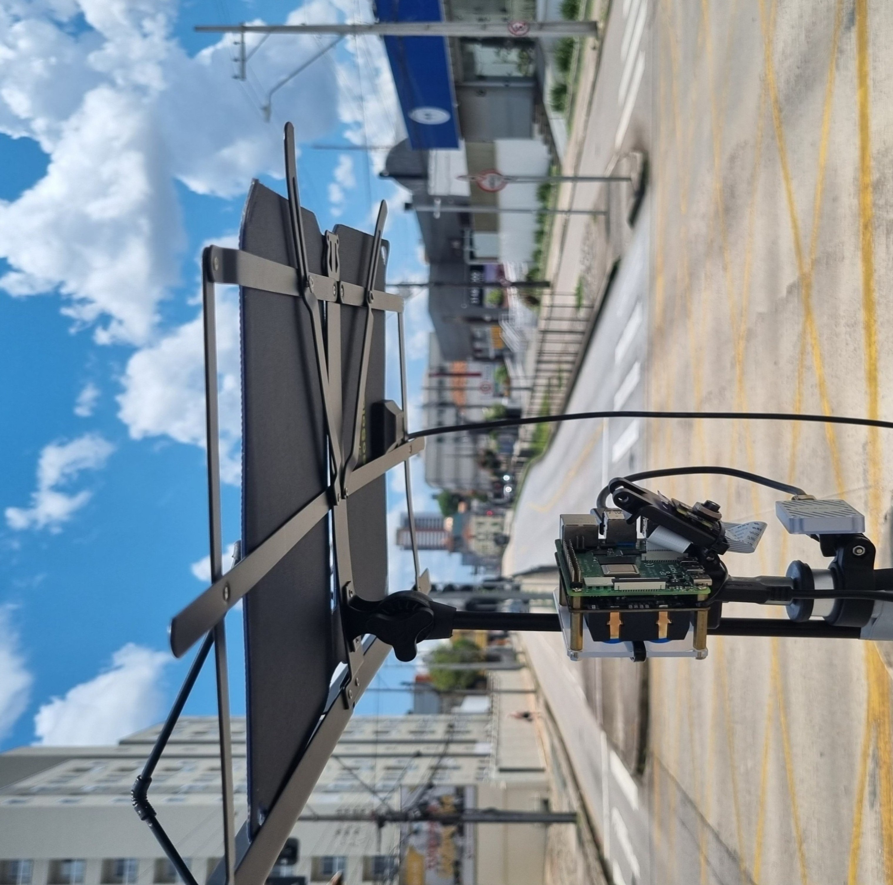
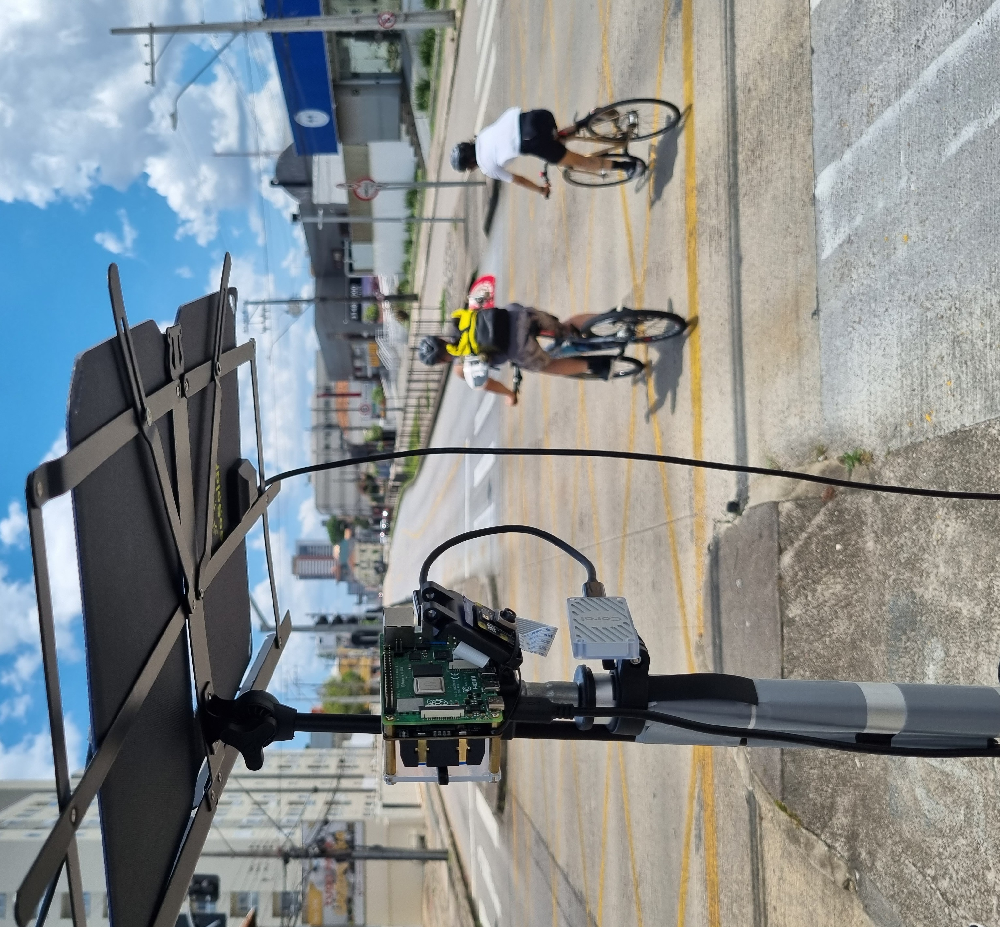
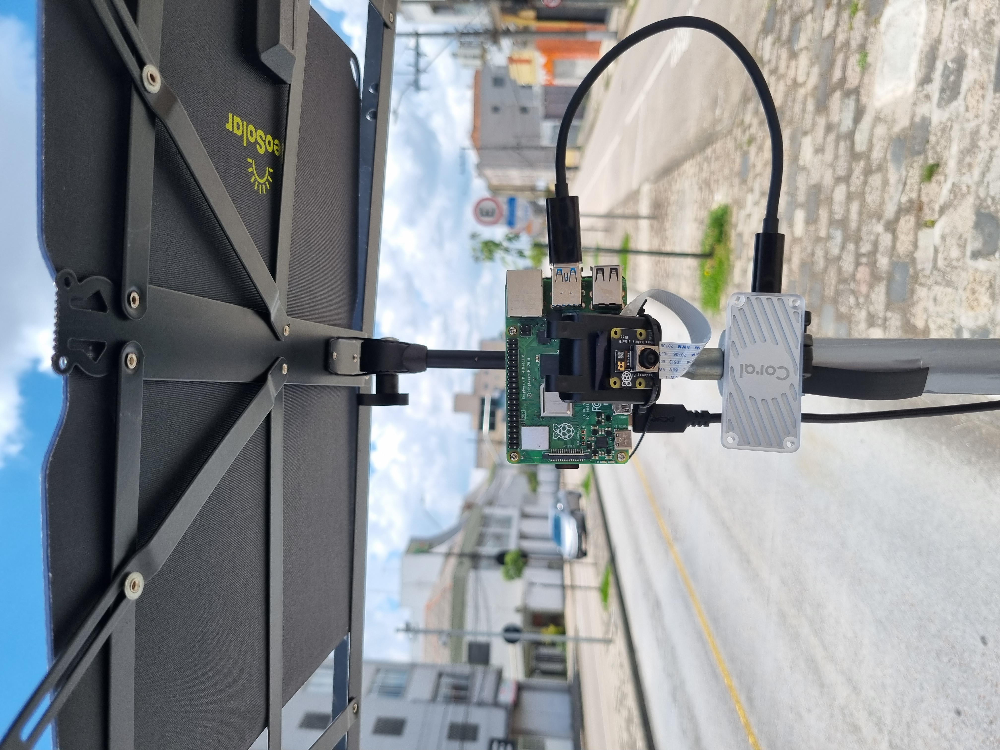
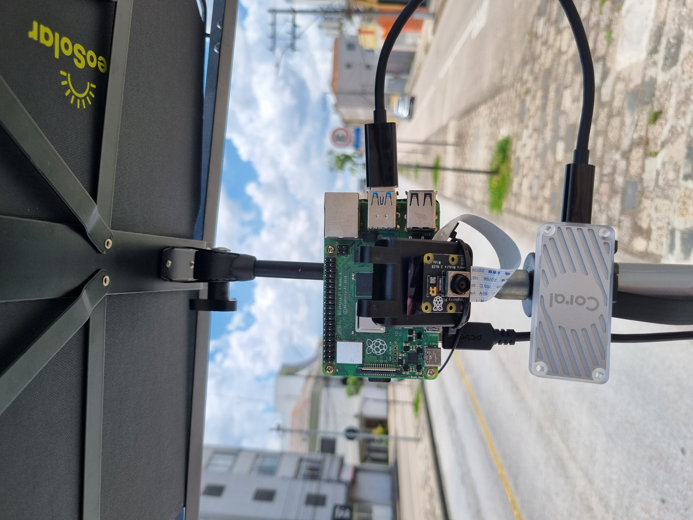
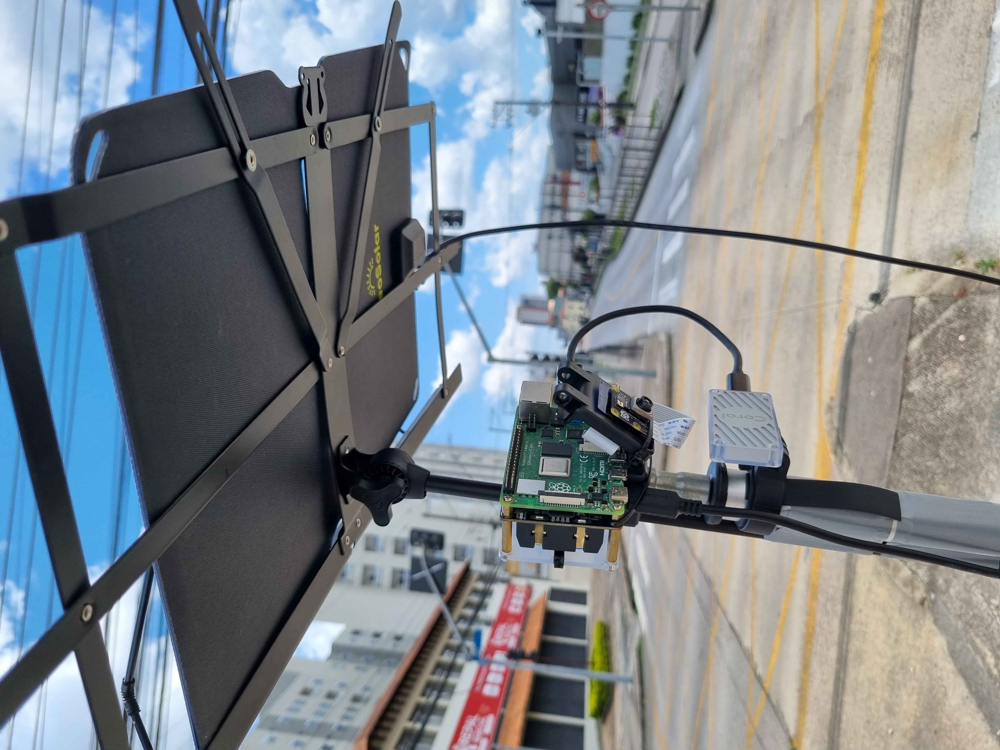

# DetCicle:: Detecção de Ciclistas :bike:

## Este projeto foi desenvolvido como tema de pesquisa de mestrado no [Programa de Pós Graduação em Computação Aplicada - PPGCA](https://www.utfpr.edu.br/cursos/coordenacoes/stricto-sensu/ppgca-ct) da [Universidade Tecnologica Federal do Paraná - UTFPR](https://www.utfpr.edu.br/).

## Proposta :dart:
DetCicle é um sistema embarcado para contagem automática de ciclistas em cenários urbanos em tempo real, através da captura de imagens por câmeras de vídeo. A contagem é realizada utilizando visão computacional e o modelo YOLOv8 de aprendizagem profunda.

### Resumo 
A detecção automática de ciclistas no cenário urbano é um campo de estudo em sistemas de transporte inteligentes e smart cities que possibilita gerar dados estruturados importantes que atuam para compreender a dinâmica da utilização do espaço urbano por ciclistas e orientar a criação de políticas públicas de ciclomobilidade e segurança no trânsito. Neste estudo, propomos um sistema embarcado móvel para detecção e contagem de ciclistas que busca ser uma solução leve utilizando a visão computacional e métodos deep learning e tem por característica ser de baixo consumo de energia e fácil manuseio, baseado nas plataformas [Raspberry Pi 4](https://www.raspberrypi.com/) e o acelerador [Edge Tpu Coral](https://www.coral.ai/products/accelerator/). O sistema desenvolvido apresentou um desempenho `F1-score` de `0,9137` para o processamento de vídeo pré-gravado. Em experimentos de contagem em campo, onde a contagem realizada pelo sistema foi comparada com a contagem humana, resultou em uma performance de contagem entre `78,3%` e `82,2%` em relação à contagem visual.

### Autor 
* Leandro Alves dos Santos

### Orientador
* Prof. Dr. Roberto Cesar Betini

### Coorientador
* Prof. Dr. Bogdan Tomoyuki Nassu

## Instalação e uso

Para o desenvolvimento e treinamento do modelo YOLOv8, foi utilizado o sistema operacional [Ubuntu 22.04](https://ubuntu.com/), e para testes em campo, foi utilizada a placa Raspberry Pi 4 com o sistema [Raspbian](https://www.raspberrypi.com/software/). As mesmas versões de bibliotecas de softwares livres foram empregadas em ambos os sistemas.

O sistema desenvolvido é baseado nas seguintes linguagens de programação e bibliotecas:

| # |  Versão   |
|-|-|
| [Python](https://www.python.org/)                                        | 3.9       |
| [TensorFlow](https://www.tensorflow.org/install?hl=pt-br)                | 2.11.0    |
| [Ultralitcs](https://docs.ultralytics.com/pt)                            | 8.0149    |
| [PyTorch](https://pytorch.org/get-started/locally/)                      | 1.13.0    |
| [Cuda](https://docs.nvidia.com/cuda/cuda-quick-start-guide/index.html#x86-64-conda)                                                         | 11.7.1    |  
| [Coral](https://www.coral.ai/docs/accelerator/get-started/#requirements) | -         |
| [Gstream](https://gstreamer.freedesktop.org/)                            | 1.24.5    |

As configurações padrão do sistema podem ser editadas no arquivo `config.py`. O modelo pode ser selecionado conforme o hardware disponível, comentando ou descomentando a linha que contém a variável `MODEL_PATH`.

Se a máquina estiver equipada com GPU, o modelo `best.pt` é mais adequado; caso contrário, o modelo `best_full_integer_quant.tflite` é otimizado para execução em CPU. No Raspberry Pi, o modelo `best_full_integer_quant_edgetpu.tflite` tem melhor desempenho de processamento. Os modelos `.tflite` são quantizados em 8 bits.

Para executar o sistema para predição em imagens ou vídeo em um desktop ou notebook, pode-se utilizar o seguinte comando:

```
cd det-cicle
python ciclist-predict.py --mode=video
```

Algumas outras variáveis podem ser passadas como parâmetros via CLI.

As seguintes tags são aceitas:

```
  --iou: IOU (default: '0.5')
  
  --conf: Confidence (default: '0.5') 
  
  --imgsz: Image Size (default: '416')
  
  --mode: Modo de operação do sistema: image, video ou capture
  
  --path: Local para carregar os arquivos de imagens ou video
  
  --result: Local para salvar o resultado
  
  --[no]save: Salvar inferências em video pré gravado (default: 'false')
  
  --time: Tempo de captura em segundos pelo sistema (default: '60.0')

  --[no]debug: Modo de depuração (default: 'false')
```

Na Raspberry Pi 4, deve ser passado `--mode=capture` para predição a partir de captura pela câmera de vídeo.. 
```
python ciclist-predict.py --mode=capture
```

O sistema foi desenvolvido apenas com a câmera [Rapberry Pi Camera](https://www.raspberrypi.com/products/camera-module-3/). Outros modelos de câmeras USB podem ser utilizados, fazendo as adaptações necessárias no código.

Em campo, o sistema pode ser iniciado através das muitas possibilidades de iniciar junto com o sistema operacional. Uma das formas mais práticas é incluir o comando no arquivo `.bashrc`. Outra possibilidade é conectar-se à Raspberry Pi via `SSH` utilizando um tablet ou mesmo um celular e então iniciar manualmente.

O módulo de carga utilizado foi a placa [`52PI`](https://wiki.52pi.com/index.php?title=EP-0118). Uma cópia da implementação para leitura do estado das baterias utilizando este módulo está disponível no pacote ups.

## Demostração e testes
<video width="640" height="480" controls>
  <source src='./assets/detcicle.mp4' type="video/mp4">
</video> 

## Montagem
<video width="640" height="480" controls>
  <source src='./assets/video.mp4' type="video/mp4">
</video> 

| | |
|-|-|
|  |   |

| | |
|-|-|
|  |   |


| | | |
|-|-|-|
|  |   |   |
